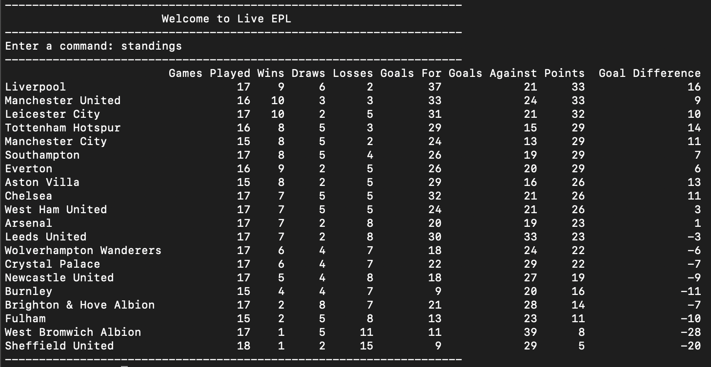
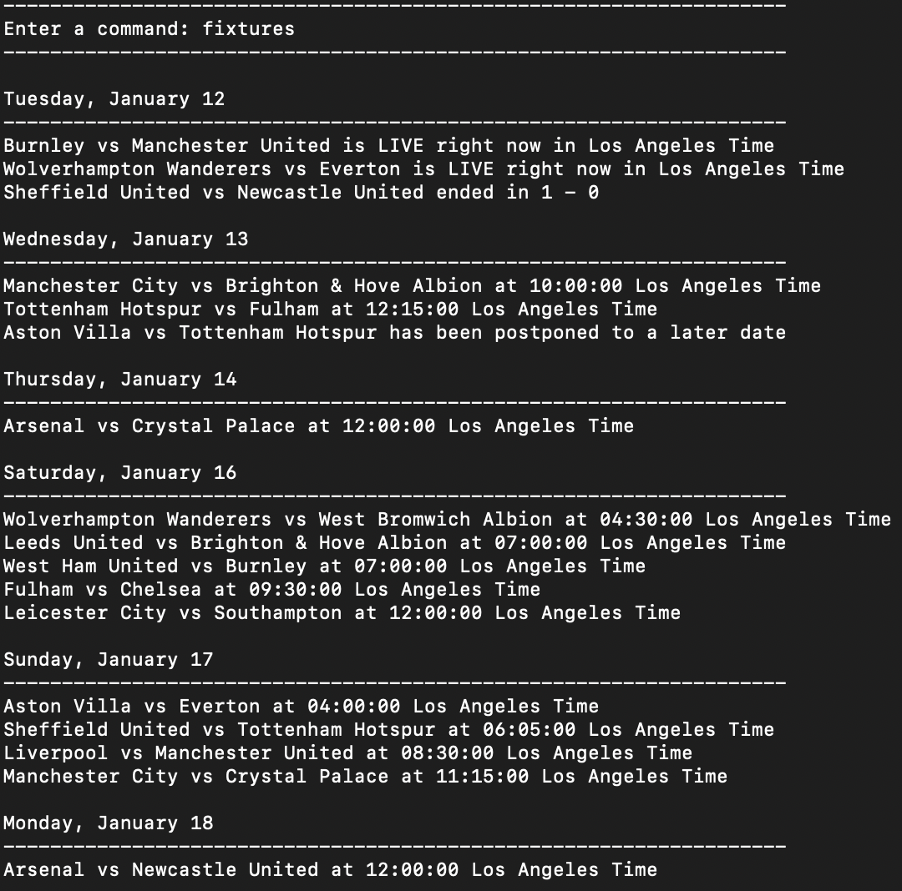
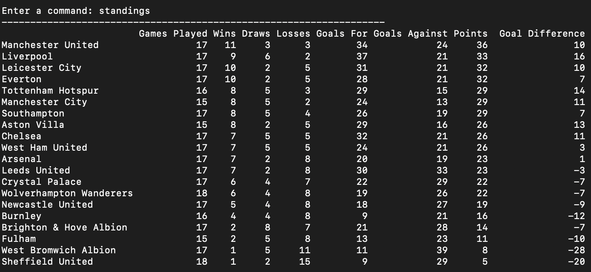
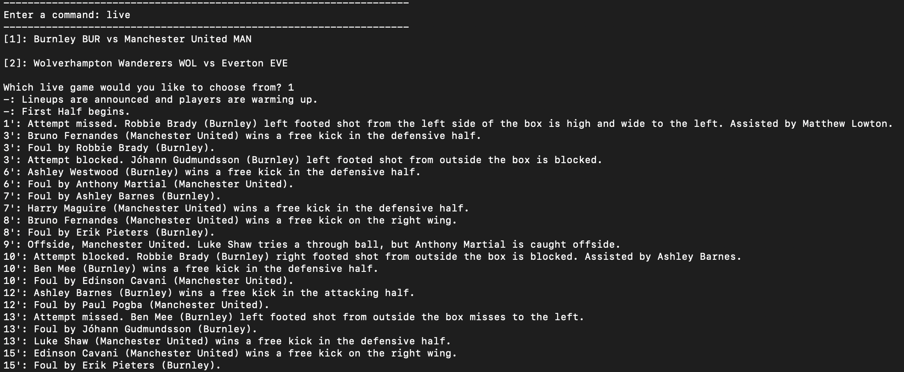
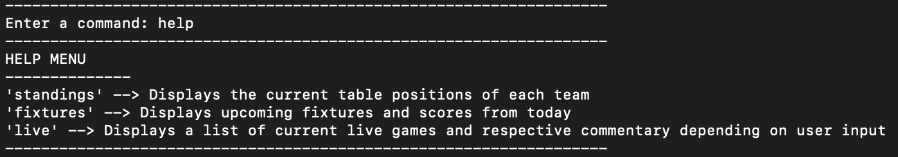

# :soccer: Live-EPL

A commandline program that is able to display the current standings, upcoming fixtures and also live commentary from the English Premier League. As this program is able to run at the commandline, users are allowed easy access to different useful data with just one input!



## Getting Started
Clone this repository to your desktop and install all the requirements by typing in terminal:
```
pip3 install -r requirements.txt
```
Note: This program is intended to be used with Python 3.


## Usage
Type in `'python3 main.py'` to run the program.
In the commandline, you can choose to type in
- `'fixtures'` for a list of upcoming fixtures and previous scores
  

- `'standings'` for a table created using Pandas that displays the current rankings of each team along with statistics such as wins, goals for,
  points etc..
  
  

- `'live'` for a list of live games which will display respective match commentary depending on user's input
  

- `'help'` for a list of implemented commands
  

## What's Next
- Looking to implement possible positions for upcoming matchweek
